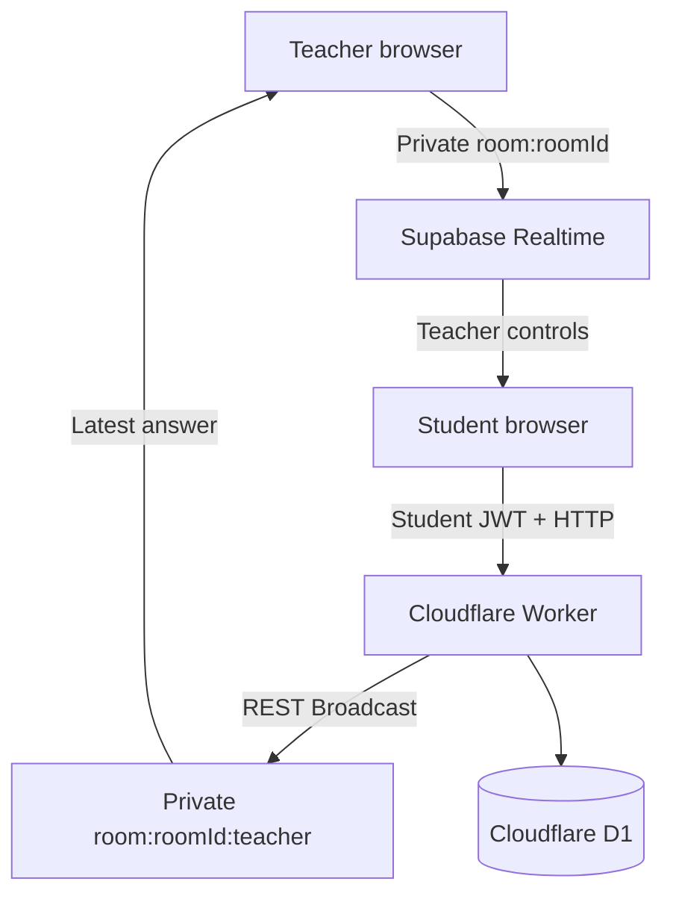

# Seats & Check Studio

教室レイアウトを作成し、学生の最新フィードバックを教員ブラウザへリアルタイム表示する、Cloudflare Workers/D1・React・Supabase Realtime構成のモノレポです。

運用前に、[Realtime Authorization設定](./docs/realtime_authorization_setup.md)、[本番デプロイガイド](./リモートデプロイ設定ガイド.md)、[トラブルシューティングRunbook](./docs/troubleshooting.md)を確認してください。APIは[API仕様書](./api_spec.md)、永続データは[ER図](./er_diagram.md)に記載しています。

## 現行アーキテクチャ

本番では、すべてのRoomがWorker管理の単一Supabase Projectを使用します。Roomごと・Teacherごとに任意のProjectを使い分ける構成ではありません。



- TeacherとStudentは、カスタムJWTを `realtime.setAuth()` へ設定してから `private: true` のChannelへ参加します。
- Teacherは `room:<roomId>` から `teacher_reset`、`student_evicted`、`teacher_lock_state`、`room_layout_updated` を送ります。
- Student回答はSupabaseへ直接Broadcastしません。`POST /api/rooms/:id/student-event` がStudent JWTを検証し、JWT claim由来の `studentId` / `name` を付与して `room:<roomId>:teacher` へ中継します。本文中の本人情報は信用しません。
- Teacher/StudentブラウザはPagesの `VITE_SUPABASE_URL` / `VITE_SUPABASE_ANON_KEY`、Worker relayはWorkerの `SUPABASE_URL` / `SUPABASE_SERVICE_ROLE_KEY` を使用します。Room APIやlocalStorageにはSupabase接続情報を保存しません。
- Supabase側では [`supabase/migrations/202608300001_realtime_authorization.sql`](./supabase/migrations/202608300001_realtime_authorization.sql) の適用、`realtime.messages` のRLS Policy、Realtime Settingsの **Allow public access OFF** が必須です。

## データ保持

D1へ永続化するのはRoom、座席レイアウト、受付状態、Teacherアカウントです。旧Supabase接続情報の列は互換性のため残しますが、アプリケーションから読み書きしません。Studentの最新回答・コメント・Teacher受信時刻はTeacherブラウザのメモリ上だけで扱います。

回答ログを恒久的にD1へ保存せず、質問別履歴、日別アーカイブ、CSV履歴エクスポートも現行機能ではありません。ページ更新、Room変更、回答リセット、ブラウザ終了等によりRealtime回答状態は失われ得ます。

## 必要環境とローカル起動

- Node.js `20.x`
- npm（lockfileに対して `npm ci` を使用）

```bash
npm ci
cd packages/backend
npx wrangler d1 migrations apply DB --local
cd ../..
npm run dev:backend
# 別ターミナル
npm run dev:frontend
```

明示的な `ENVIRONMENT=development` / `test` だけが既知の開発用JWT Secretと初期Teacher (`teacher_admin` / `admin123`) へfallbackします。production、未設定、未知の値では、未設定・既知の開発用SecretによるToken発行と、既知の初期パスワードによるTeacher作成を拒否します。

## 画面

- `/`: Teacherログイン
- `/room_layout`: Room・座席レイアウトの管理
- `/seats/monitoring`: 最新回答、受付ON/OFF、reset、seat lock、evictionの監視操作
- `/student/monitoring`: 現在の着席状態
- `/user/teacher`: Teacherアカウント管理
- `/student/:roomId`: Studentチェックイン、座席選択、回答

Project URLと公開anon keyはPagesのビルド環境変数に設定します。`service_role` keyをブラウザへ公開したりD1へ保存したりしてはいけません。

## 無料構成

本リポジトリは [Supabase Free](https://supabase.com/pricing) と [Cloudflare Workers Free](https://developers.cloudflare.com/workers/platform/pricing/) の範囲で構成でき、Private Channel / Realtime Authorizationのために有料Planを必須化していません。アプリ、workflow、セットアップ手順に課金・自動Plan移行・クレジットカード登録を要求する処理はありません。利用量が各社の最新Free limitsを超えないかは公式ページで確認してください。

Supabase Free Projectは低アクティビティ時にpauseされる可能性があります。[`supabase-keep-alive.yml`](./.github/workflows/supabase-keep-alive.yml) はRepository Secretsの `SUPABASE_URL` と `SUPABASE_ANON_KEY` を使い、3日ごとに単一ProjectのREST APIへ疎通します。これはpauseの可能性を低減する運用補助であり、成功保証や有料移行を行うものではありません。詳細は[設定手順](./docs/realtime_authorization_setup.md#4-supabase-keep-alive)を参照してください。

現行コードはSupabaseのlegacy `anon` / `service_role` keyとlegacy JWT secretを使用します。新しいpublishable/secret keyおよびSigning Keysへの移行は将来候補であり、今回の運用要件ではありません。最新情報は[Supabase API keys](https://supabase.com/docs/guides/getting-started/api-keys)を確認してください。

## Realtime障害時

Student回答は常に認証付きHTTP relayで送信します。Student Realtime ChannelはTeacher制御イベントの受信用です。`CHANNEL_ERROR`、`TIMED_OUT`、`CLOSED` ではRoom状態確認用のHTTP fallbackを有効化し、10秒後に安全に再接続します。fallbackはStudent回答を7秒ごとに再送する機能ではありません。

Teacher側が正常表示になるのは、ブラウザnetwork online、main Channel `SUBSCRIBED`、Teacher Inbox `SUBSCRIBED` のすべてを満たす場合だけです。障害時は画面のエラーコードを控え、[Runbook](./docs/troubleshooting.md)のログ確認先を参照してください。

## 検証

```bash
npm ci
npm run build
npm run typecheck
npm run test
git diff --check
```

`main` へのpushで [`.github/workflows/deploy.yml`](./.github/workflows/deploy.yml) がNode 20を使ってbuild/typecheck/test、D1 migration、Worker、Pagesの順に本番デプロイします。merge前に[デプロイ前チェックリスト](./docs/realtime_authorization_setup.md#デプロイ前チェックリスト)を完了してください。
