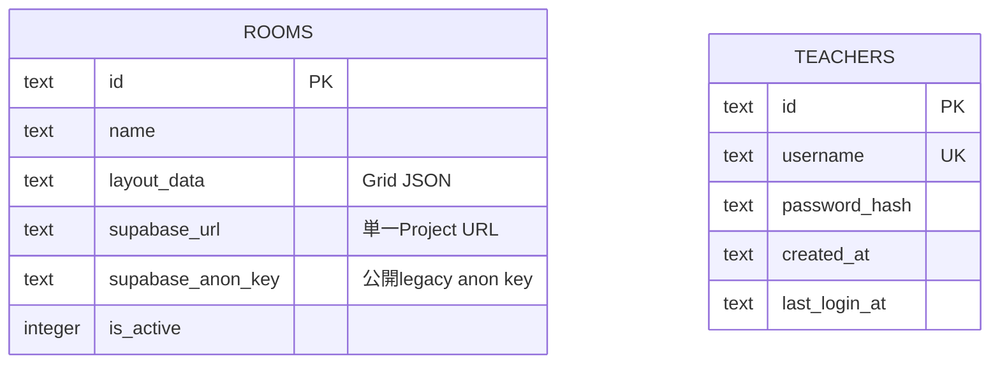

# 永続データとRealtime境界

## Cloudflare D1

RoomとTeacherの間に所有者foreign keyはありません。現行Teacherは認証後に全Roomを管理できます。`service_role` key、JWT secret、Teacher JWTはD1へ保存しません。

## Supabase Realtime（揮発性）

- `room:<roomId>`: Teacherが制御eventをBroadcastし、対象RoomのTeacher/Studentが購読
- `room:<roomId>:teacher`: WorkerがStudent回答をREST Broadcastし、Teacherだけが購読

Student回答、コメント、Teacher受信時刻はTeacherブラウザのメモリ上だけです。D1への回答履歴、質問別archive、日別履歴、CSV履歴データはありません。refresh、Room変更、reset、ブラウザ終了で失われ得ます。

Realtime Authorizationの外部設定は [`docs/realtime_authorization_setup.md`](./docs/realtime_authorization_setup.md) を参照してください。
